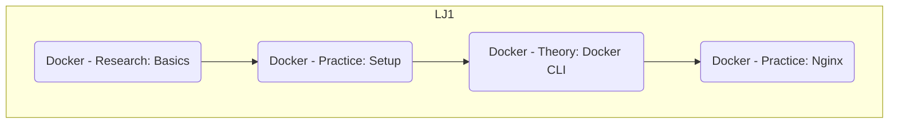

# Docker

> - [Roadmap](https://roadmap.sh/r/docker-roadmap-m7t8c)

## Tasks

---

### LJ1

#### Docker - Research: Basics

- [theory/1-basics.md](./theory/1-basics.md)

#### Docker - Practice: Setup

- [practice/1-installation.md](./practice/1-installation.md)
- [theory/2-setup.md](./theory/2-setup.md)

#### Docker - Theory: Docker CLI

- [theory/3-docker-cli.md](./theory/3-docker-cli.md)

#### Docker - Practice: Nginx

- [practice/2-nginx.md](./practice/2-nginx.md)
