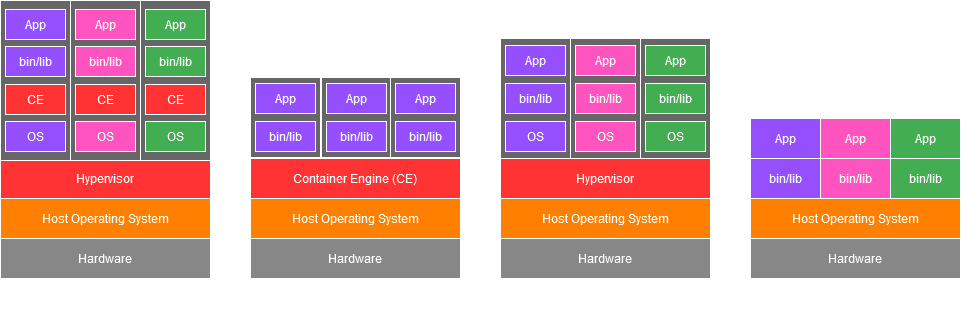

# Basics

Docker is an open-source platform that enables developers to automate the deployment, scaling and management of applications by packaging them into lightweight and portable **containers**.  

- [What are Containers?](#what-are-containers)
- [Why do we need Containers?](#why-do-we-need-containers)
- [Containers vs. VMs vs. Bare Metal](#containers-vs-vms-vs-bare-metal)

## What are Containers?

Containers are lightweight, portable, and isolated environments that allow developers to package applications with all their dependencies, libraries, and configurations. This packaging ensures that the application runs consistently across different environments, whether it's on a developer's laptop, a testing server, or in production.  

Containers are more efficient than traditional virtual machines because they share the host OS kernel, allowing multiple containers to run on the same system with minimal overhead. Docker simplifies the creation, deployment, and scaling of applications.

## Why do we need Containers?

The main benefit of Containers is, that they solve the issue around inconsistent environments ("it works on my machine" problem).  

Another reason for choosing docker containers is the ability to easily scale and replicate containers.

## Containers vs. VMs vs. Bare Metal

> Bare metal describes a computer that is running directly on the hardware without any virtualization.

Containers combine the benefits of Virtual Machines (isolation) and bare metal (no extra OS installation).

